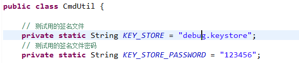
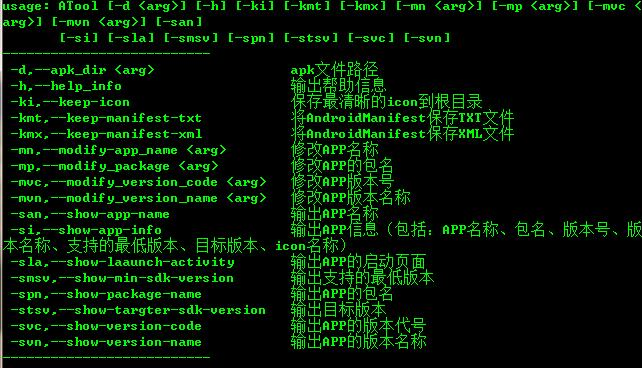

## ATool ##

### 一、为什么会有ATool？ ###

因为笔者的工作关系，经常需要查看或者修改APK信息（比如：APP名称、敏感权限、版本、包名和icon等信息）。一般，查看APK信息，我们会用到jadx或者aapt等工具来进行查看；而修改包体信息，我们可能会先用apktool对包体进行反编译，然后修改成自己想要的内容后再进行回编签名。

虽然apktool功能强大，基本上已经可以满足我们的需求，但是操作上还是相对比较繁琐。在使用apktool的过程中，笔者就想，能不能在apktool和aapt的基础上开发一个简单好用的工具，同时还可以兼容查看和修改信息的，于是就有了这个工具**ATool**。

### 二、ATool能做什么？ ###

- **查看APP信息**
	- APP名称
	- APP包名
	- 版本信息
	- 支持安装的版本
	- 启动页面名称
	- APP的icon
	- 导出icon
	- 导出清单文件
- **修改APP内容**
	- 包名
	- 版本名称
	- 版本代号
	- APP名称

**关于Apk二次签：**

使用**ATool**修改APP内容后，默认用**debug.keystore**进行签名打包。我们可以在`CmdUtil`类中进行修改，替换成自己的签名文件。

### 三、ATool是怎么工作的？ ###

**查看Apk信息：**

通过aapt获取Apk的信息（包名、版本、清单文件内容等）

直接获取Apk文件中的二进制文件进行解析、保存，高效快捷！！！

**修改Apk内容：**

利用apktool对Apk进行反编译和二次打包（我们只需要输入apk路径和替换的内容即可，**ATool**就会进行自动替换和签名打包，简单快捷！！！）

### 四、怎么使用ATool？###

我们可以直接通过命令行来使用：

首先进入ATool所在的目录：

查看帮助信息：

输入命令行，完成操作：

### 五、开发实现 ###

**Apk信息获取**

我们可以通过aapt查看或者是利用apktool反编译后解析清单文件来获取。这里，因为我们只需要查看信息，所以笔者采用第一种方式，直接利用aapt命令来获取。

对应的aapt命令如下：

>aapt.exe d badging [apk路径]

其他常用的aapt命令：

查看APK中的AndroidManifest.xml内容

>aapt d xmltree [apk路径]  AndroidManifest.xml

查看APK中所用的权限列表
>
>aapt d permissions [apk路径] AndroidManifest.xml

通过在命令行中输入以上命令，我们可以获取到这样的信息：

	package: name='com.example.example' versionCode='1' versionName='1.0'
	sdkVersion:'8'
	targetSdkVersion:'19'
	application-label:'Example'
	application-icon-160:'res/drawable-mdpi/ic_launcher.png'
	application-icon-240:'res/drawable-hdpi/ic_launcher.png'
	application-icon-320:'res/drawable-xhdpi/ic_launcher.png'
	application-icon-480:'res/drawable-xxhdpi/ic_launcher.png'
	application: label='Example' icon='res/drawable-mdpi/ic_launcher.png'
	application-debuggable
	launchable-activity: name='com.example.example.MainActivity'  label='Example' ic
	on=''
	uses-feature:'android.hardware.touchscreen'
	uses-implied-feature:'android.hardware.touchscreen','assumed you require a touch
	screen unless explicitly made optional'
	main
	supports-screens: 'small' 'normal' 'large' 'xlarge'
	supports-any-density: 'true'
	densities: '160' '240' '320' '480'

那么接下来， 我们要做的就是去通过这段内容中获取需要的apk信息，主要代码如下：

	public static Map<String, String> getAppInfo4Map(String apkPath) {
		if (!FileUtils.getFileFormat(apkPath).equals("apk")) {
			apkPath = apkPath + ".apk";
		}

		BufferedReader bReader = CmdUtil.getCmdResult4Reader("aapt.exe d badging " + apkPath);
		Map<String, String> packageinfoMap = new HashMap<String, String>();

		try {
			String line = "";
			String packageName = "";
			String versionCode = "";
			String versionName = "";
			String appName = "";
			String iconName = "";
			String clearIconPath = "";
			String sdkVersion = "";
			String targetSdkVersion = "";

			while ((line = bReader.readLine()) != null) {
				if (line.contains("package:")) {
					String tempPackageStr = line.split("package: name='")[1];
					packageName = tempPackageStr.substring(0, tempPackageStr.indexOf("'"));

					String tempVersionCode = line.split("versionCode='")[1];
					versionCode = tempVersionCode.substring(0, tempVersionCode.indexOf("'"));

					String tempVersionName = line.split("versionName='")[1];
					versionName = tempVersionName.substring(0, tempVersionName.indexOf("'"));
				}
				if (line.contains("application-label")) {
					appName = line.substring(line.indexOf("'") + 1, line.lastIndexOf("'"));
				}
				if (line.contains("application-icon")) {
					iconName = line.substring(line.lastIndexOf("/") + 1, line.lastIndexOf("'"));
					clearIconPath = line.substring(line.indexOf("'") + 1, line.lastIndexOf("'"));
				}
				if (line.contains("sdkVersion:")) {
					sdkVersion = line.substring(line.indexOf("'") + 1, line.lastIndexOf("'"));
				}
				if (line.contains("targetSdkVersion:")) {
					targetSdkVersion = line.substring(line.indexOf("'") + 1, line.lastIndexOf("'"));
				}
			}
			// 关闭数据流
			bReader.close();
			// 保存我们想要的信息
			packageinfoMap.put("package_name", packageName);
			packageinfoMap.put("version_code", versionCode);
			packageinfoMap.put("version_name", versionName);
			packageinfoMap.put("app_name", appName);
			packageinfoMap.put("icon_name", iconName);
			packageinfoMap.put("clear_icon_path", clearIconPath);
			packageinfoMap.put("min_sdk_version", sdkVersion);
			packageinfoMap.put("target_sdk_version", targetSdkVersion);

		} catch (IOException e) {
			e.printStackTrace();
		}

		return packageinfoMap;
	}

另外，可能我们还需要保存Apk的icon和清单文件（后续，我们可以加上窗体界面，直接显示Apk信息），代码如下：

	public static void keepTempAppIcon(String apkPath) {
		Map<String, String> infoMap = getAppInfo4Map(apkPath);
		
		if (!FileUtils.getFileFormat(apkPath).equals("apk")) {
			apkPath = apkPath + ".apk";
		}
		ZipUtils zipFileUtils = new ZipUtils();
		zipFileUtils.copyFileFromZip(apkPath, infoMap.get("clear_icon_path"), AToolConstant.TEMP_ICON_NAME);
	}

保存清单文件：

	public static void keepTempManifestTxtFile(String apkPath) {
		try {
			String xmlContent = AXMLPrinter.getManifestXMLFromAPK(apkPath);
			FileUtils.writeTxtFile(xmlContent, new File(AToolConstant.MANIFEST_TFILE_NAME), "UTF-8");
		} catch (Exception e) {
			e.printStackTrace();
		}
	}

保存icon和清单文件都是通过直接操作Apk文件来实现的。

关于APk文件，可以把它理解为是一个压缩文件，所以这里我们可以直接解压，然后把res文件下的icon保存到本地；至于清单文件也是这样，解压获取后再进行转换解析就可以了，具体逻辑请参考工程中的代码实现。

**修改Apk内容**

笔者是直接同过apktool进行反编译修改后进行二次打包。这里需要对反编译后的清单文件进行解析，修改，然后再进行回编。（后续笔者将加上其他功能，比如修改icon、替换文件等）

这里以修改包名为例，部分代码如下：

	public boolean modifyPackage(String targetStr) {
		boolean result = false;
		try {
			if (curDocument == null) {
				noInitCurDoceumntTip();
				return result;
			}
			if (StringUtils.isEmpty(targetStr)) {
				strParamEmpty("新的包名");
				return result;
			}

			result = XmlUtils.modifyElementAttribute(curDocument, "manifest", "package", targetStr, curXmlName);
		} catch (Exception e) {
			e.printStackTrace();
		}

		onResultTip(result, "修改包名 " + targetStr);
		return result;
	}

操作反编译后的清单文件：

	/**
	 * 修改当前只有一个元素的元素属性
	 * 
	 * @param elementName
	 * @param attribute
	 * @param targetStr
	 * @param parentElement
	 * @return
	 */
	public static boolean modifyElementAttribute(Document curDocument, String elementName, String attribute,
			String targetStr, String newXmlName) {
		boolean result = false;
		NodeList curNodeList = curDocument.getElementsByTagName(elementName);
		for (int i = 0; i < curNodeList.getLength(); i++) {
			if (curNodeList.item(i) instanceof Element) {
				Element manElement = (Element) curNodeList.item(i);
				if (manElement.getAttribute(attribute) != null) {
					manElement.setAttribute(attribute, targetStr);
					break;
				}
			}
		}

		result = commitCurElement(curDocument, newXmlName);
		return result;
	}

关于操作xml文件，笔者这里用到的是DOM来实现的。

### 六、最后 ###

以上就是ATool工具的主要内容，目前功能还相对简单；后续笔者将会添加新的功能（比如替换icon、空文件多渠道打包等），也希望大家多多交流！！！

